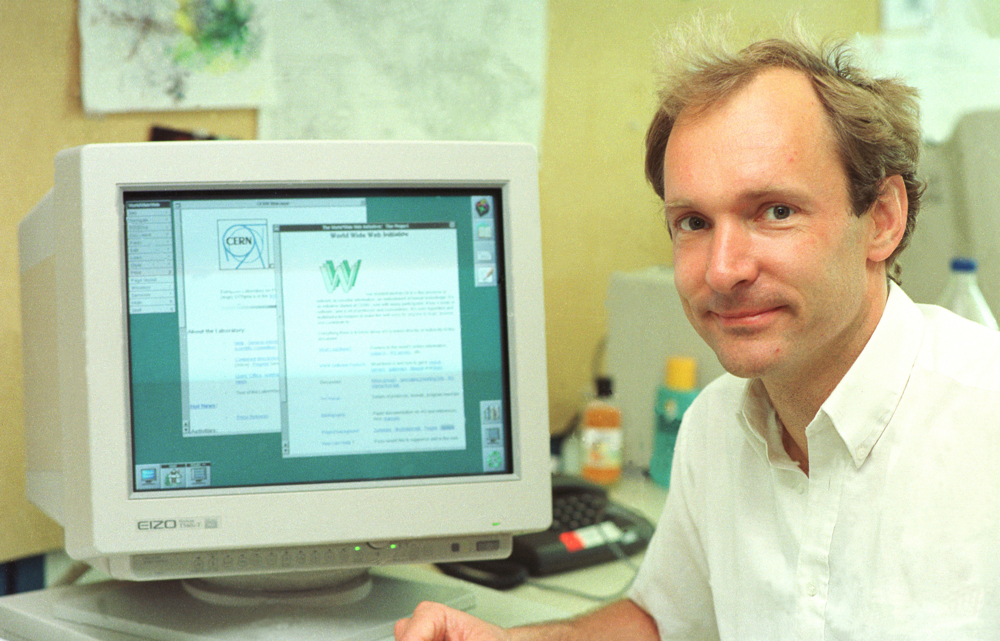
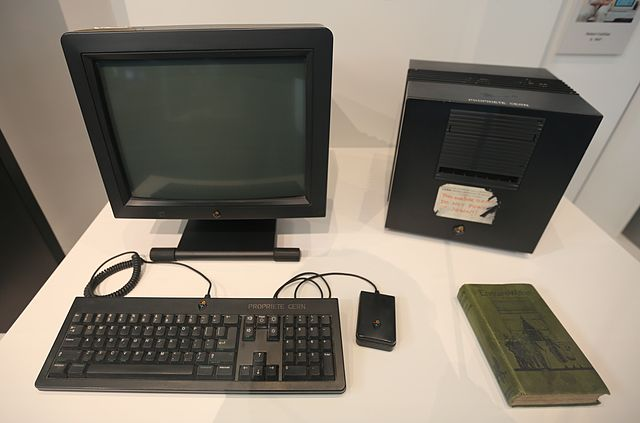
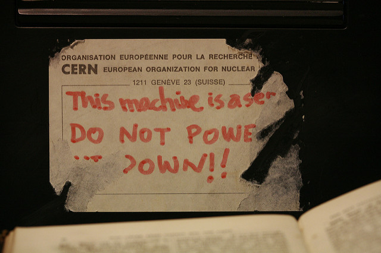

<iframe src="../assets/header.html" width=100% height=28></iframe>

<!-- ######################################### -->

#World Wide Web

##WWW

How many times have you seen `www.` at the start of a URL? It is so ubiquitous that many web browsers and web sites will insert it into the URL even if you do not type it. But that `www.` is a special part of a domain's address that indicates that it is a server that hosts content that is designed to meet the standards of the **W**orld **W**ide **W**eb. And almost every online service you likely use is a part of the World Wide Web. 

In fact, the World Wide Web is one of those things that most of us use on a regular basis without ever thinking about how it works or what problems it was originally created to solve. But, since its inception in the early 1990s, the Web has proven to be one of the most revolutionary and empowering inventions in history.

Not to be confused with the broader concept of the _internet_, the _World Wide Web_, itself, is a content-oriented ecosystem that has been built atop the globally networked infrastructure of the internet. It was designed primarily to provide an open platform that could provide uses from all over the world a standard and accessible means of communicating and sharing information online.

##Origins and Growth of the Web

"In those days, there was different information on different computers, but you had to log on to different computers to get at it. Also, sometimes you had to learn a different program on each computer. Often it was just easier to go and ask people when they were having coffee..." &mdash; Tim Berners-Lee

While working at CERN near Geneva, Switzerland, British computer scientist, **Tim Berners-Lee**, recognized the potential of the internet as a communications and computational medium and proposed the development of a platform that might help to overcome some of its limitations.

As the internet became more established, the world's many computers, servers, routers, and other computational devices gradually became networked together into a worldwide, interconnected ecosystem. However, much the same way that the introduction of air travel in the early 1900's suddenly brought together people from far off lands who spoke different languages, shared different customs, and adhered to different laws, the internet also exposed similar differences and incompatibilities between the world's various computing systems.

Berners-Lee proposed that a standardized set of protocols and tools be developed that might help to ease the integration of these disparate computing systems and to facilitate improved communications between them. In short, he wanted to employ the ideas of abstraction to design a more generalized means of sharing information across the internet that was independent of any particular hardware or software that a user might be using.

As a result of his efforts, Berners-Lee created the set of fundamental tools and technologies that make up what we now more familiarly know of as the World Wide Web*.

**Web Applications:**

+ **Web browser**
	+ Client application that runs on an end-user's computer and it used to request and view web pages
 
+ **Web server**
	+ Program that runs on a remote computer and that serves up web pages

**Web Technologies:**

+ **HTML** (_Hypertext Markup Language_)
	+ A standardized set of formatting instructions that dictate how the content of a web page should be arranged and displayed by the client application (i.e., web browser)

+ **URI** (_Uniform Resource Identifier_)
	+ A unique address that identifies each resource on the web
	+ Also known as a **URL** (_Uniform Resource Locator_)

+ **HTTP** (_Hypertext Transfer Protocol_)
	+ Standards for requesting and receiving linked resources from across the Web

On August 6, 1991, Berners-Lee brought the world's [first web site](http://info.cern.ch/hypertext/WWW/TheProject.html) online. It ran on a NeXT cube computer located in his lab at CERN and prominently displayed a sticker on the front of the machine which read, "This machine is a server. DO NOT POWER IT DOWN!!"

 

*Interestingly enough, "World Wide Web" was not the only name that Berners-Lee considered when choosing a name for his creation. He almost named it by one of his other ideas: _Information Mesh_, _Mine of Information_, or _Information Mine_. Consider how <strike>the Web</strike> _the Mine_ might look today with URLs like `moi.google.com` or `moi.facebook.com` instead of our familiar `www.` prefix.

##Hyperlinks

One of the key features that Berners-Lee incorporated into his invention is the use of _hyperlinks_ to connect documents with one another in a non-linear way. Unlike the pages of a book are arranged linearly in sequence (e.g., page 1, page 2, page 3, etc.), there is no such sequencing of documents in the World Wide Web. Instead, like the multiply connected computers of the internet, the Web consists of a collection of massively interconnected pages of content.

Each web page is effectively a single, text-based document that has been "marked up" with embedded formatting instructions  known as HTML (**H**yper**t**ext **M**arkup **L**anguage) _tags_. Each of these electronic documents are stored on a computer running a web server. The location of the file within the computer's file system corresponds to the documents URL (i.e., the _address_ of the web page).

A _hyperlink_ is a clickable bit of text, image, or other on-screen element within an HTML document that a user can select to request another, related document. Each link is designed to enable the user to selective seek out, or _browse_, from one document to the next, following whatever sequence they choose. This non-linear approach to organizing and connecting information has created an unlimited number of new ways that people can find, learn, and consume information.

Consider the following bit of HTML:

	You can <a href="http://www.google.com">search</a> for 
	something, <a href="http://www.twitter.com">tweet</a> a 
	comment, or <a href="http://www.facebook.com">like</a> a 
	friend's post at these popular sites.

The above example, would produce the following hyperlinked text within a web page:
	

	You can <a href="http://www.google.com">search</a> for 
	something, <a href="http://www.twitter.com">tweet</a> a 
	comment, or <a href="http://www.facebook.com">like</a> a 
	friend's post at these popular sites.

Here, you can see that "_search_," "_tweet_," and "_like_" have each been formatted to act as hyperlinks (linking to Google, Twitter, and Facebook, respectively). Each hyperlink is denoted with the use of an _anchor_ (`<a>...</a>`) tag that frames the text being linked (e.g., "_search_," "_tweet_," and "_like_"). Each anchor tag includes the URI of the other page or site that the hyperlink is referencing (e.g. `href="..."`).

When a user clicks on any of these links, the web browser sends a request to the corresponding web server for the specified page (as referenced in the `href` tag).

##Exercise #1: Map the Web

Build a map of the World Wide Web. OK, maybe not _all_ of it (It is rather large, after all.). In this exercise, you will begin mapping out the interconnectedness of a _very small_ portion of the Web. 

1. Using your preferred search engine ([Google](http://www.google.com), [Bing](http://www.bing.com), [DuckDuckGo](http://www.duckduckgo.com), etc.), conduct a search for your own name.
2. Record the URL of the first link that your search returns.
3. Visit that URL and count and record the total number of different links that you can find on that page.
4. Also record the URLs of up to 3 more of the hyperlinks on that page.
5. Continue repeating this process counting and recording hyperlinks for each URL you record for at least two more levels.

Using your findings, estimate the total number of different pages that could be reached if you were to start at the URL found from your original "vanity search" (i.e., searching for your own name) and followed a series of five clicks. What about 10 clicks? 20 clicks?

##Exercise #2: Wikipedia Race

Your teacher will select a random topic for you to look up on [Wikipedia](https://www.wikipedia.org/). This will be your starting point for the race. Your teacher will then name a second topic. This will be your target. Your goal is to browse through Wikipedia to reach your target topic by only clicking on hyperlinks within the body of Wikipedia article. What is the shortest path that you can find to get from the starting topic to the ending topic (i.e., following the fewest number of links)?

<!-- ######################################### -->

<iframe src="../assets/footer.html" width=100% height=60></iframe>
