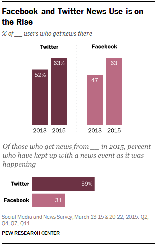

<iframe src="../assets/header.html" width=100% height=28></iframe>

<!-- ######################################### -->

#Social Networking

##Exploring _Your_ Digital World

Throughout this course, we will be exploring the many different ways that computational technology shapes our lives and impacts what we do, how we learn, and who we interact with. Along the way, one of the primary goals of the course is to help you discover not only how you can use technology in your everyday activities but also how you can master these tools and shape them in new and innovative ways that will enhance and enrich your own life in the years to come.

At its heart, computer science is about using existing technology in novel ways to create new tools and solutions to problems that have never beentackled before. Your goal in this course should be to increase your role from merely a passive consumer of computational technology (as you likely already are) to an active and innovative creator of technological solutions.

In the upcoming units, we will focus on both the global impact of today's emerging technologies as well as learn the techniques and skills needed to create innovative solutions that have not even been discovered yet.

##Yesterday's Technology

While it is becoming increasingly difficult to comprehend, there was actually a time in which most of the modern-day conveniences we take for granted did not yet exist. Things like Facebook, Twitter, Instagram, and Snapchat, for instance, are all relatively new phenomena that have rapidly taken over our culture and forever changed the ways that we connect and interact with one another. But each of these and many other similar technologies now form such an integral component of our digital lifestyles that it is hard to imagine how we might have ever been able to function without these everyday resources.

The truth is, this has always been true about all forms of technology throughout the history of human civilization. All revolutionary forms of technology change people's behavior in ways that make the past seem crude and arcane. Modern digital technology is no different. And even today's cutting-edge innovations will one day feel slow and laborious when something even better inevitably comes along.

##Social Interaction Before the Internet

Human beings are social creatures. We have engaged in social interaction since the dawn of civilization, from families to tribes to villages to towns to cities to nations. Originally, most interaction was face-to-face and benefited greatly from the invention of spoken language. But over time, the advent of different technologies, like parchment and written languages, has expanded our reach, increased our capabilities, and altered our behavior. Through writing, we were suddenly able to communicate over great distances of both space and time. Only in the last couple of decades has that interaction moved away from physical form and into the virtual world of electronic communication. And again, it has had a profound impact on our behavior and fostered new forms of social interactions throughout various societies and populations.

##Social Structures

One of the most empowering features of electronic social media has been its ability to create a sense of community, especially in places or situations where such a community could not have otherwise existed. With the global scope and widespread reach of social media, previous obstacles like geography, age, or socioeconomics, that isolated groups of people from one another are no longer barriers. Individuals with shared interests, but whose paths would never have crossed in the "real world," are able to come together, communicate, and interact in the virtual world of an online social network.

This increased ability to find someone who shares the same interests as you allows marginalized individuals to experience a unique sense of belonging. Likewise, the centralized nature of social networking environments enables new and unique special interest groups and facilitates coordination of group projects and collaboration in a way that was previously difficult, if not impossible.

##The Sharing Economy

"I would expect that next year, people will share twice as much information as they share this year, and next year, they will be sharing twice as much as they did the year before." &mdash; Mark Zuckerberg, November 2008

The rise in popularity of social networking in recent years has radically altered people's perceptions of privacy and their willingness to "share" what previously had always been seen as personal and/or private information. In 2008, shortly after Facebook opened up its service to the public at large, Mark Zuckerberg [made headlines](http://bits.blogs.nytimes.com/2008/11/06/zuckerbergs-law-of-information-sharing/) with his bold assumption that people would be increasingly willing to share anything and everything about themselves, regardless of privacy issues. At the time, most critics scoffed at Zuckerberg's naiveté and arrogance to make such an assumption. However, through the growth and popularity of services like Facebook and Twitter, users, and time, have proven Zuckerberg to be surprisingly correct.

This raises the question of whether people of the past were actually private for privacy's sake or if their reluctance to publicly share personal information had more to do with the simple lack of any effective way to do it. After all, before text messaging, tweeting, or blogs existed, there really was no effective way for individuals to reach out to "the world" and express themselves. It was the invention of a set of new, digital technologies that suddenly enabled this ability to freely and broadly share oneself openly with those who might listen.

Think about that for a second. A young, 24-year-old, college dropout with a unique and controversial vision of the future created a website and forever changed an entire society's attitudes toward personal privacy and public sharing &mdash; all through computational technology.

##The New News

Historically, technology has always played a key role in democratizing societies and empowering individuals by enabling broader access to careers and capabilities that had previously been limited to an elite few. In recent years, we have seen such a shift occurring in the ways people access and report news events. The rise of blogs and social networks and the ubiquity of internet-connected camera phones has created a new opportunity for "citizen journalism" in which literally _anybody_, regardless of their journalistic training or experience, can witness and report on important, socially impacting events.

In fact, a recent [study](http://www.journalism.org/2015/07/14/the-evolving-role-of-news-on-twitter-and-facebook/) by the Pew Research Center shows that an increasing number of Americans are now getting their news from online, social sites like Facebook and Twitter. This marks a radical shift in the way information is disseminated throughout the public and, perhaps more importantly, who controls that flow of information. Traditionally, as the only, common source of news, the journalistic community has served to filter and shape the news as it sees fit. However, with the free and open access for anybody to share breaking events, a much more diverse set of voices has emerged.

This newfound and wide-reaching platform for free speech also threatens/promises to overturn the status quo by giving voice to individuals or groups who have historically been marginalized by the mainstream press. For example, in 2011, social media [played a key role](http://www.journalism.org/2012/11/28/role-social-media-arab-uprisings/) in the ouster of Egyptian President Hosni Mubarak and launched a wave of social revolution across the region by using social media to organize demonstrations and to relay events to the rest of the world "like a megaphone."

##Assignment

When you go home, find a parent, grandparent, or other adult from an earlier generation with whom you can sit down for a few minutes to discuss the different forms of social interaction and networking that they grew up with.

You should ask questions that will allow you to compare and contrast their experiences with your own. Some ideas for things you might discuss include the following:

+ What kinds of social activities did you engage in?
+ How often did you socially interact with others?
+ Who did you interact with socially? How far away from you did they live?
+ Do you still have contact with them today?
+ What tools or technology, if any, did you use to interact with others?
+ What have been the biggest technological changes in social interaction that you have seen since you were younger?
+ How would you have done things differently if today's social media tools were available when you were younger?

Write a short summary of the things you learn from your conversations that includes the following items:

+ Identify five aspects of social interaction that have fundamentally changed since they were your age.
+ Identify five aspects of social interaction that are more or less the same as when they were your age.
+ Describe the most surprising thing that you learned about social interaction in the past and explain why it was so surprising.
+ Identify one way that you think social interaction might change between now and the _next_ generation (i.e., in 20 &ndash; 30 years).

<!-- ######################################### -->

<iframe src="../assets/footer.html" width=100% height=60></iframe>
