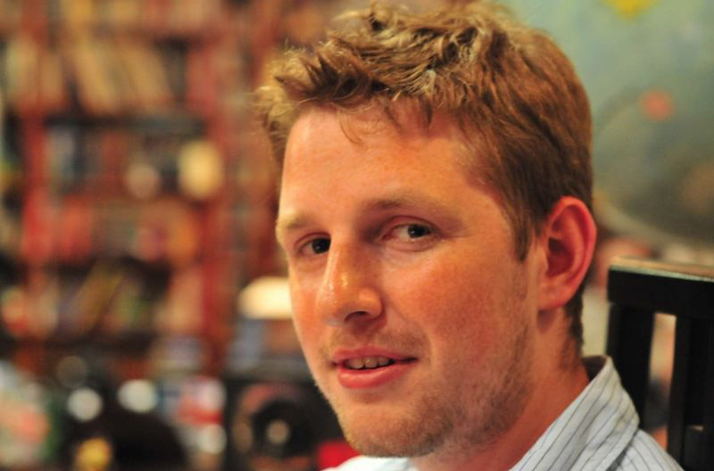
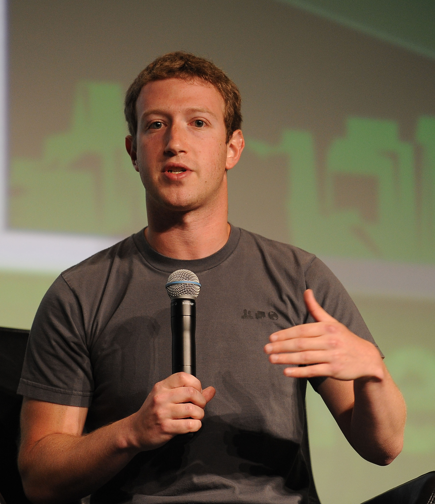
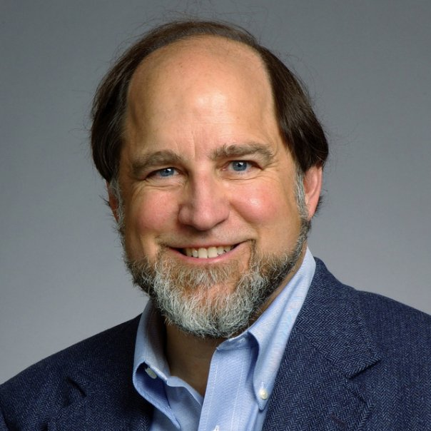

<iframe src="../assets/header.html" width=100% height=28></iframe>

<!-- ######################################### -->

#Pioneers in Computing

##Hedy Lamarr (1914 &ndash; 2000)

When you think of technological pioneers in the world of secure, global, high-speed telecommunications, the last person you would likely ever picture is a glamorous 1940s Hollywood starlet. But that is exactly who we have to thank for the cellphones in our pockets today.

At the height of her movie career, Hedy Lamarr proved to also be an accomplished inventor. During World War II, she developed and patented "a method of secret communication which is relatively simple and reliable in operation, but at the same time is difficult to discover or decipher" ([US Patent 2292387](http://www.google.com/patents/US2292387)). This technology, better known as "frequency hopping spread spectrum" is the integral component behind many of today's wireless communication protocols, including Bluetooth, Wi-Fi, GPS, and cellular phones.

Back in 1942, however, long before the existence of smartphones and laptops (or even _computers_ as we know them today), World War II was raging and Hedy Lamarr learned of a problem that US submarines frequently encountered in which German forces would "jam" (block) the signals being sent from the subs to their radio-controlled torpedos. In her own attempt to help with the war effort, Lamarr devised a system for continuously altering the frequency of a signal, thus preventing the enemy from locking onto and blocking the signal. While she received a patent for her invention, the US Navy did not adopt her technique into their ships for another 20 years.

Today, more than 70 years after her invention, Lamarr's frequency hopping spread spectrum ([FHSS](https://en.wikipedia.org/wiki/Frequency-hopping_spread_spectrum)) technology has been integrated into many of our most familiar, household communication devices. In fact, in 1997, three years before Lamarr's death, she saw her invention formally adopted into the IEEE's [802.11](http://ieeexplore.ieee.org/stamp/stamp.jsp?tp=&arnumber=654749) telecommunications standard used for all Wi-Fi routers, hotspots, and other wireless devices.

Hedy Lamarr is just one of the thousands upon thousands of inventors, innovators, creators, and entrepreneurs who have helped contributed to our modern, digital world. Though their imaginative and revolutionary thinking, these individuals have helped to permanently shape the ways that we work and interact.

##Achievements, Inspirations, and Connections

"If I have seen further, it is by standing on the shoulders of giants." &mdash; Isaac Newton

For your next assignment, you will get to know a few of these individuals and explore the ways that their influence can still be felt today. Some of the names might already seem familiar to you (e.g., Bill Gates, Steve Jobs, Mark Zuckerberg, etc.), but even their stories are often far more interesting and their contributions more wide reaching than you know once you look deeper into their bodies of work. Many other names are likely completely new to you despite the fact that you use and rely on the results of their work every day. The real thrill of looking back on these early pioneers is to spot the connections between them and to see how each of them have influenced, inspired, and enabled the achievements of the others.

While each of these individuals has had a profound influence on the world of computing, this list is only a very small sampling of the many people who have built this industry. And unlike most other fields of study that go back centuries, many of the pioneers of computer science are still alive and actively working and advancing the industry. In fact, [The 30 Most Influential Computer Scientists Alive Today](http://www.computersciencedegreehub.com/30-most-influential-computer-scientists-alive-today/) profiles a number of additional modern-day pioneers that you might want to consider.

##Assignment
Read through the lists of pioneers at the bottom of this page and look up a number of the names to learn their stories and discover their contributions to the world of computational technology.

Your final report should include the following items:

1. Identify at least five individuals that you have looked up and state the notable achievements and/or contributions to computing for which each is most known.
2. Choose one of these pioneers and thoroughly describe their lasting impact on our world and ways that their achievements can still be seen, felt, or used today.
3. Identify at least one other person from the list below whose own achievements were enabled by or benefited from the pioneer you have previously profiled.

##Early Computer Design

The design of the modern computer is less than a century old, with many of its origins coming out of the challenges of cryptology and automated code breaking during World War II. But the fundamental principles of logic and the earliest "computing devices" and "programs" can be traced back more than a century before that.

+ Charles Babbage
+ Alonzo Church
+ Joseph Marie Jacquard
+ Ada Lovelace
+ John von Neumann
+ Alan Turing

##Computing Systems

The physical machines we call computers have come in many different shapes and sizes over the decades (ranging from computers the size of an entire building to miniaturized devices in our pockets and on our wrists). In addition, the ways we interact with these machines has changed as various methods and forms of human-computer interfaces have been invented (e.g., mechanical switches and dials, punch cards, graphical user interface, mouse, multi-touch screens).

+ Seymour Cray
+ Michael Dell
+ John Presper Eckert
+ Larry Ellison
+ Douglas Englebart
+ Bill Gates
+ Herman Hollerith
+ Grace Hopper
+ Steve Jobs
+ John Mauchly
+ Jef Raskin
+ Dennis Richie
+ Linus Torvalds
+ Steve Wozniak

##Programming Languages

_Java_, _C++_, _Python_, _Perl_, _Swift_, ... The list of programming languages goes on and on. Some are more popular than others. Some are used more widely than others. And some are more capable than others. But no single language is any better than all of the rest. Instead, each programming language has been specifically designed to meet the particular programming needs for its time and intended uses. And unlike natural languages, such as English, French, Chinese, or Swahili, which are developed over centuries by whole societies, programming languages are often uniquely designed by small teams or individuals who gain notoriety in their own right for creating the tools that enable developers to produce the wealth of software that we use everyday.

+ James Gosling
+ Grace Hopper
+ Alan Kay
+ Chris Lattner
+ John McCarthy
+ Dennis Richie
+ Guido van Rossum
+ Bjarne Stroustrup
+ Larry Wall
+ Niklaus Wirth

##The Internet and the World Wide Web

The introductions of the internet in the early 1970s and the World Wide Web in the early 1990s have enabled us to connect, communicate, and share with others from all parts of the globe as easily as if they were right next door. This universal ability to remotely connect and share information between _any_ two computing devices has been made possible only through the efforts of the individuals who have developed the well-designed set of networking standards, systems, and protocols that we rely on, like TCP/IP, HTML, BitTorrent, RSS, blogging platforms, etc.

+ Marc Andreessen
+ Tim Berners-Lee
+ Vint Cerf
+ Bram Cohen
+ Matt Mullenweg
+ Alexis Ohanian
+ Aaron Swartz

##Online Platforms and Services

While the internet and World Wide Web have provided the backbone for global networking and communication, the true democratization of the medium that has given voice to the broad masses by making this complex technology immediately accessible to _anybody_, regardless of their technological literacy. In recent years, countless online services have been built upon the capabilities of the internet, including Google, Facebook, Flickr, DropBox, Twitter, and Wikipedia. Each of these services has grown out of a vision of technological and social innovators who saw a need and built a networked platform to serve that need and reshape the ways we interact.

+ Sergey Brin
+ Stewart Butterfield
+ Ward Cunningham
+ Jack Dorsey
+ Drew Houston
+ Pierre Omidyar
+ Larry Page
+ Jimmy Wales
+ Jerry Yang
+ Mark Zuckerberg

##Software Developers

.jpg)

In contrast to large-scale, general-access platforms like Facebook or Google, many software developers turn their attention to the development of singular, stand-alone, software programs that serve very specific, end-user functions. These software programs range from productivity tools (e.g., Microsoft Word, Adobe Photoshop, VisiCalc) to recreational games (e.g., Tetris, Super Mario Bros., The Legend of Zelda) and beyond.

+ Luis von Ahn
+ Paul Allen
+ Bill Atkinson
+ Dan Bricklin
+ Nolan Bushnell
+ John Carmack
+ Thomas and John Knoll
+ Shigeru Miyamoto
+ Gabe Newell
+ Alexey Pajitnov

##Technology Entrepreneurs 

Of course, computational technology is not limited to computer programs. Many enterprising entrepreneurs have taken advantage of advances in computing technology to spin off a number of commercial and altruistic ventures that are only loosely related to their computational underpinnings, including Amazon, Tesla Motors, Nest Labs, Khan Academy, Craigslist, and Wolfram Alpha.

+ Marco Arment
+ Jeff Bezos
+ Ed Catmull
+ Tony Fadell
+ Salman Khan
+ Elon Musk
+ Craig Newmark
+ Stephen Wolfram

##Computer Theorists

Rather than using technology to create commercialized products or services, many of the most notable computer scientists dedicate their careers to the advancement of the field as a whole and focus their efforts on inventing the ideas, methods, and models for improving the efficiency and effectiveness of computing technology. These computer theorists explore the leading edge of computational thinking and problem solving by addressing such grand topics as artificial intelligence, encryption, data compression, search, data storage, digital logic, and human-computer interaction, just to name a few.

+ Leonard Adleman
+ George Boole
+ Haskell Curry
+ Whitfield Diffie
+ Edsger Dijkstra
+ C.A.R. Hoare
+ David A. Huffman
+ Donald Knuth
+ Marvin Minsky
+ Gordon Moore
+ J Strother Moore
+ Randy Pausch
+ Ron Rivest
+ Bertrand Russell
+ Adi Shamir
+ Claude Shannon

<!-- ######################################### -->

<iframe src="../assets/footer.html" width=100% height=60></iframe>
